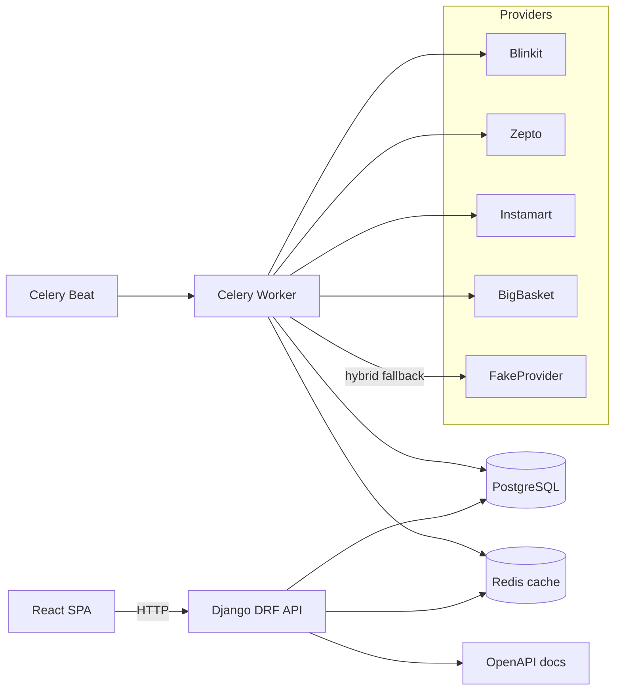
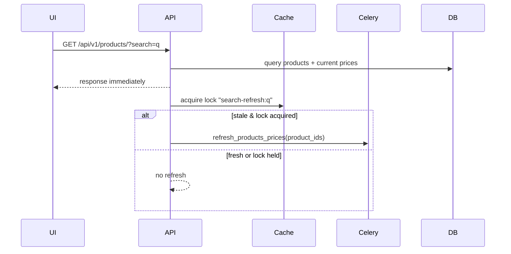
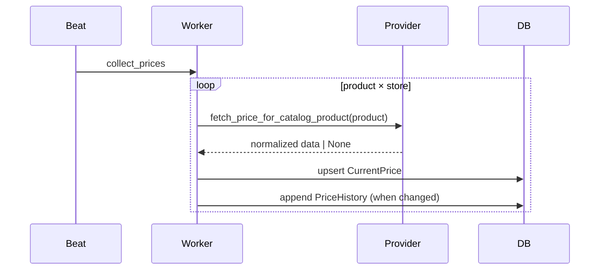

# PricePulse

Compare grocery prices across **Blinkit**, **Zepto**, **Swiggy Instamart**, and **BigBasket** in one place.

PricePulse is a full-stack grocery price comparison app built to look and behave like a real product: multi-store comparisons, history charts, alerts, analytics, and a polished UI. It is designed to run locally via Docker and be explainable in technical interviews.

## Overview

The same SKU can have different prices across stores. PricePulse:
1. Tracks a small catalog of products.
2. Collects current prices per store through a provider layer.
3. Stores history for charts and drop detection.
4. Shows cheapest store, savings, and deep links to the store product page.

Guest mode allows a full demo without registering.

## Features
- Multi-provider comparison (Blinkit · Zepto · Instamart · BigBasket)
- Product list search + filters + details page
- Store comparison table including **MRP**, **discount %**, **ETA**, stock, and “Visit store” link
- Price history + per-product stats
- Dashboard + analytics summaries
- Wishlist (local) + price alerts (guest email required)
- JWT auth (register/login/refresh) + guest session
- Hybrid provider mode: live providers (best-effort) with deterministic fallback
- Background collection (Celery + beat)
- Docker Compose local stack

## Architecture



## Folder Structure

```text
pricepulse/
  backend/
    apps/
      accounts/        # User + profile
      catalog/         # Products/brands/categories
      pricing/         # Stores, prices, history, providers, collection
      notifications/   # Alerts + notification delivery
    common/            # Health, pagination
    config/            # Settings, URLs, Celery config
    entrypoint.py      # Docker bootstrap helper
    Dockerfile
  frontend1/frontend/  # React/Vite SPA
  docs/                # Architecture + deployment docs
  docker-compose.yml
  README.md
```

## Tech Stack

Backend: Django, DRF, SimpleJWT  
Workers: Celery, django-celery-beat  
Database: PostgreSQL  
Cache/Broker: Redis  
Frontend: React, Vite, React Router, TanStack Query  
UI: Tailwind, Framer Motion, Recharts  
Providers: httpx + optional Playwright (best-effort)

## Provider Architecture

### Normalized schema

All providers normalize into:

```text
ProductResult {
  name, brand, unit,
  image_url, product_url,
  mrp, selling_price,
  in_stock, delivery_eta,
  source, raw
}
```

Normalization utilities live in `backend/apps/pricing/providers/base.py` (`build_product`, `parse_money`, `styled_text`, `extract_unit`) so parsing logic is not duplicated across providers.

### Why Playwright + Hybrid Mode

These platforms do not provide stable public APIs and aggressively block cold HTTP scraping. Playwright interception works in a real browser session, but is inherently brittle and region-dependent. Hybrid mode keeps the product usable by falling back to deterministic demo data when live capture fails.

Provider flow (all four providers):
1. Optional aggregator (if configured)
2. Cold HTTP (often blocked)
3. Playwright JSON interception (best-effort)
4. DOM fallback (heuristic)
5. Return `[]` so hybrid mode can fall back

### Logos & images

Store logos are self-hosted: `frontend1/frontend/public/logos/*.svg` (no remote CDNs).  
Product images come only from provider `image_url` and persist to `Product.image_url`; otherwise the UI uses `public/images/product-placeholder.svg`.

## Search Flow (DB-first freshness)



## Collection Flow



## Background Jobs

Celery beat schedules periodic collection (`apps.pricing.tasks.collect_prices`). Search freshness may trigger targeted refresh via `refresh_products_prices`.

## Database Design

- `catalog.Product` stores `image_url` (persisted from providers) plus an optional uploaded image.
- `pricing.CurrentPrice` stores the latest store price for each `(product, store)` including MRP, ETA, URL.
- `pricing.PriceHistory` stores snapshots used for charts and drop detection.

Indexes are added for the query patterns used by list endpoints and stats.

## Docker (Local)

```bash
docker compose up --build
```

Services:
- Frontend: http://localhost:5173
- Backend: http://localhost:8000
- API docs: http://localhost:8000/api/docs/
- Health: http://localhost:8000/health/

Defaults:
- `PROVIDER_MODE=fake` for reliable demos
- `PROVIDER_USE_PLAYWRIGHT=False` for clean first boot

Windows note: if Docker fails with `invalid file request Dockerfile` under OneDrive, move/clone the repo to a non-OneDrive path (reparse points break Docker builds).

## Environment Variables

Backend: see `backend/.env.example`  
Frontend:
- `VITE_API_URL` (default `http://localhost:8000/api/v1`)
- `VITE_API_DOCS_URL` (optional; used for footer link)

## Local Setup (No Docker)

Backend:
```bash
cd backend
cp .env.example .env
pip install -r requirements.txt
python manage.py migrate
python manage.py seed_data
python manage.py runserver
```

Frontend:
```bash
cd frontend1/frontend
npm install
npm run dev
```

## Deployment (Reference)

See:
- `docs/Deployment.md`
- `docs/Architecture.md`
- `docs/ProviderArchitecture.md`

## API Endpoints (Core)

- `GET /api/v1/products/` (search + pagination)
- `GET /api/v1/products/<id>/`
- `GET /api/v1/products/<id>/prices/` (preferred comparison shape)
- `GET /api/v1/products/<id>/history/`
- `GET /api/v1/products/<id>/stats/`
- `GET /api/v1/analytics/summary/`
- `POST /api/v1/alerts/` (guest email required; authenticated uses account email)

## Screenshots

Add screenshots under `docs/screenshots/`:
- `home.png`
- `products.png`
- `detail.png`
- `dashboard.png`
- `analytics.png`
- `login.png`

## Design Decisions

- Hybrid mode exists to keep demos stable under anti-bot restrictions.
- Provider normalization is centralized to reduce drift and make new providers easy to add.
- DB-first search avoids blocking users on slow provider calls while keeping data fresh.

## Scaling Strategy (What changes at 100k users)

Blockers / next steps:
- Replace Playwright scraping with official APIs/aggregators wherever possible.
- Add provider job queues and a browser pool to control concurrency.
- Add retention policies for history (or move to time-series storage).
- Add observability (Sentry, structured logs, metrics) and per-endpoint latency budgets.
- Cache hot product lists and analytics aggregates; precompute rollups.

## License

MIT. Store names and logos are used for demonstration only.
