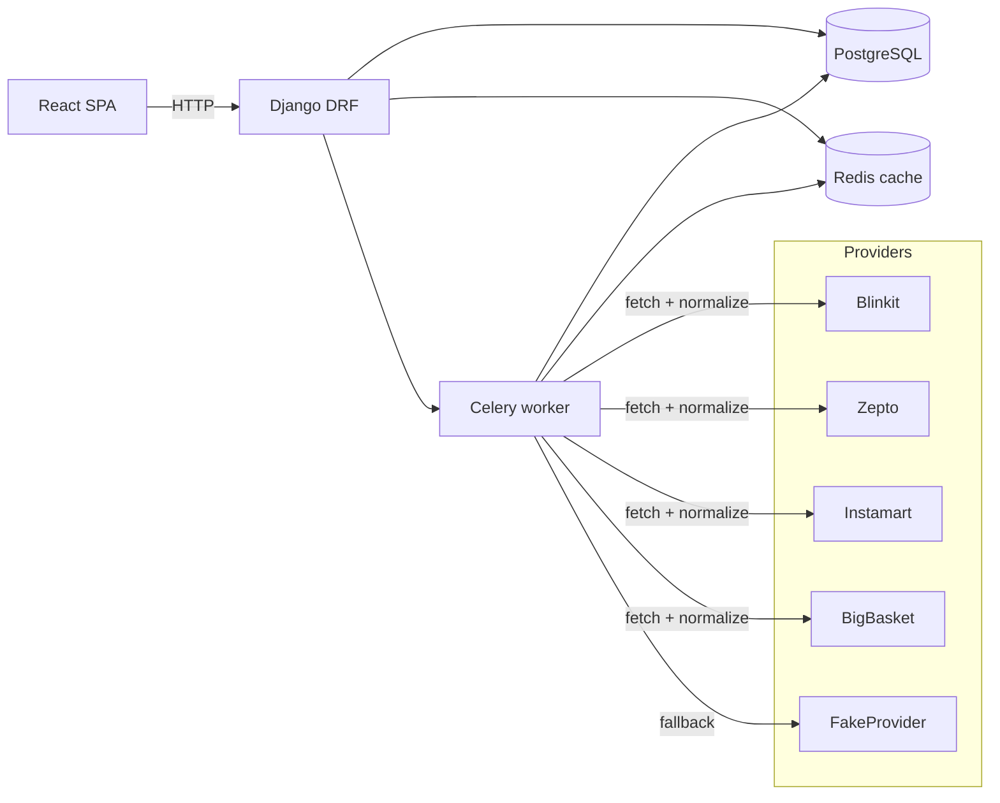
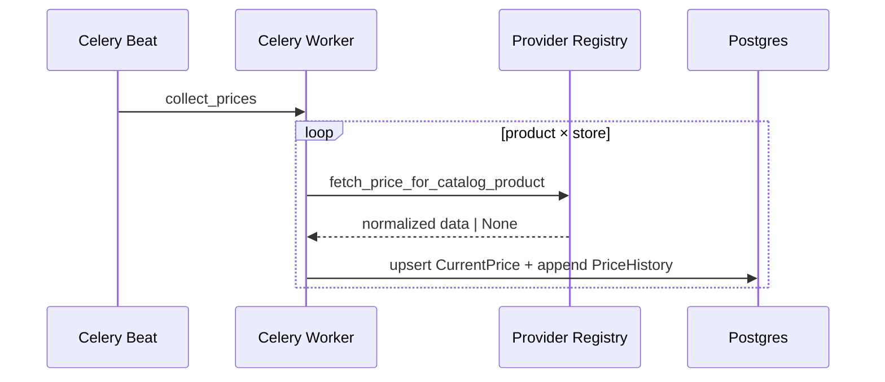

# Architecture

This document explains PricePulse request flow, collection flow, and key design decisions.

## High-Level Diagram

## Request Flow

### Product list / search
1. Client calls `GET /api/v1/products/?search=...`
2. Backend returns catalog products + aggregated cheapest/highest via `CurrentPrice`.
3. If results are stale, backend triggers a background refresh task (deduped by cache lock).

### Product details
1. Client calls `GET /api/v1/products/<id>/`
2. Client calls `GET /api/v1/products/<id>/prices/` (preferred) with nested store rows.
3. Client calls `GET /api/v1/products/<id>/history/` and `/stats/` for charts and stats.

## Collection Flow

## Provider Normalization
- All providers emit the same normalized fields via `providers/base.py` (`build_product`).
- Live providers are best-effort; hybrid mode keeps the product experience stable.

## Caching
- Provider search responses are cached per `(provider, query, lat, lon)` for 5 minutes.
- Search freshness uses a short-lived cache lock to prevent stampedes.

## Trade-offs
- Live scraping is inherently brittle (anti-bot + region + session). The project chooses a hybrid fallback so the product remains usable and demoable.